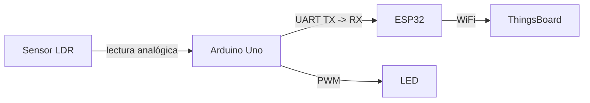

# 💡 TP IoT — Monitor de Luz con Arduino + ESP32

Sistema embebido que mide la luminosidad ambiental con un sensor LDR, controla la intensidad de un LED de forma proporcional, y envía los datos en tiempo real a la plataforma **ThingsBoard** a través de un ESP32 conectado por WiFi.

---

## 🏗️ Arquitectura del sistema



**Flujo de datos:**

1. El **Arduino** lee el valor del sensor LDR por entrada analógica
2. En función del valor leído, ajusta el brillo del LED vía PWM
3. Envía el valor de luz al **ESP32** por comunicación serial (UART)
4. El **ESP32** recibe el dato y lo publica en **ThingsBoard** vía MQTT/WiFi

---

## 📚 Documentación Técnica y Configuración

Toda la información referente al armado del circuito, conexiones, uso de divisores de tensión, y configuración de software se encuentra centralizada en el siguiente documento:

👉 **[Ver Configuración y Conexiones del Hardware](docs/configuracion_y_conexion.md)**

---

## 📁 Estructura del proyecto

```
tp-iot-luz/
│
├── arduino/
│   └── sensor_luz/
│       └── sensor_luz.ino           ← Sketch principal: lectura LDR + control LED
│
├── esp32/
│   └── thingsboard_uploader/
│       ├── thingsboard_uploader.ino ← Recepción UART + envío a ThingsBoard
│       ├── config.example.h         ← Plantilla de credenciales (subir al repo ✅)
│       └── config.h                 ← Credenciales reales (NO subir al repo ❌)
│
├── docs/
│   ├── configuracion_y_conexion.md  ← Guía de configuración y conexionado hardware/software
│   ├── diagrama_circuito.png        ← Esquemático del circuito completo
│   ├── diagrama_flujo.png           ← Diagrama de flujo del sistema
│   └── informe.md                   ← Informe técnico del TP
│
├── .gitignore
└── README.md
```

---

## 🤝 Flujo de trabajo en equipo (Git)

Usamos **Git + GitHub** para versionar todo el proyecto. La herramienta recomendada es **GitHub Desktop**.

| Qué modificar                                 | Con qué programa                              |
| --------------------------------------------- | --------------------------------------------- |
| Sketches `.ino`                               | Arduino IDE                                   |
| Documentación en `.md`, `config.example.h`    | Editor de texto (VS Code, Notepad++, etc.)    |

**Rutina de trabajo:** Hacer siempre un **Pull** antes de editar. Luego de editar, hacer Commit con mensaje descriptivo y Push.

---

## 👥 Integrantes

| Avatar | Nombre Completo | Perfil de GitHub |
| :---: | :--- | :---: |
|  | Carlos Ricardo Gugliermino Zuñiga | [](https://github.com/carlex74) |
|  | Nicolás Pedemonte | [](https://github.com/NiconiKImg) |
|  | Luca Trincavelli | [](https://github.com/LucaTvl) |
|  | Franco Zariaga | [](https://github.com/Frasquito3) |
