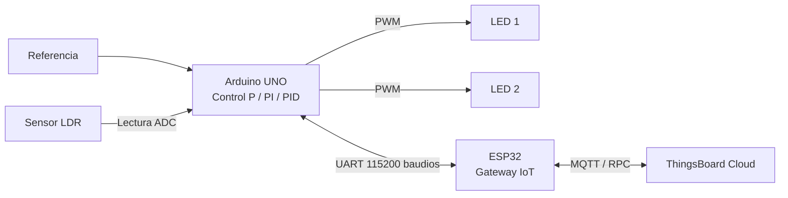

# TPI 2026 — Control de luminosidad con Arduino, ESP32 y ThingsBoard

Sistema distribuido para identificar, controlar y supervisar una planta de luminosidad formada por dos LEDs y un sensor LDR.

El **Arduino UNO** ejecuta localmente los controladores P, PI o PID y aplica la señal PWM. El **ESP32** funciona como gateway: recibe la telemetría por UART, la publica en **ThingsBoard Cloud** mediante MQTT y reenvía las solicitudes RPC al Arduino.

## Arquitectura del sistema


```mermaid
    graph LR   
        SP["Referencia"] --> Arduino["Arduino UNO<br/>Control P / PI / PID"]   
        LDR["Sensor LDR"] -->|"Lectura ADC"| Arduino 
        Arduino -->|"PWM"| LED1["LED 1"] 
        Arduino -->|"PWM"| LED2["LED 2"] 
        Arduino <-->|"UART 115200 baudios"| ESP32["ESP32<br/>Gateway IoT"] 
        ESP32 <-->|"MQTT / RPC"| TB["ThingsBoard Cloud"]
```


El control se ejecuta localmente en el Arduino y no depende de la conexión WiFi ni de la disponibilidad de ThingsBoard.

El ESP32 se encarga de:

- Recibir la telemetría del Arduino.
- Publicar los datos mediante MQTT.
- Recibir solicitudes RPC.
- Reenviar comandos al Arduino.
- Gestionar las reconexiones WiFi y MQTT.

## Funciones principales

- Identificación de la planta mediante un ensayo de respuesta al escalón.
- Control digital configurable como P, PI o PID.
- Período de control de 10 ms.
- Promedio de 20 conversiones ADC.
- Filtro exponencial de la medición.
- Filtro de la acción derivativa.
- Saturación de la señal PWM entre 0 y 255.
- Integración condicional anti-windup.
- Transferencia suave entre los modos AUTO y MANUAL.
- Supervisión local mediante un display LCD 16x2 con interfaz I2C.
- Publicación de telemetría mediante MQTT.
- Configuración remota mediante solicitudes RPC.
- Reconexión automática de WiFi y MQTT.

## Estructura del repositorio

```text
TPA-TPINTEGRADOR/
├── arduino/
│   ├── ensayo_escalon/
│   │   └── ensayo_escalon.ino
│   ├── pid_controller/
│   │   └── pid_controller.ino
│   └── sensor_luz/
│       └── sensor_luz.ino
├── docs/
│   └── configuracion_y_conexion/
│       └── configuracion_y_conexion.md
├── esp32/
│   └── thingsboard_uploader/
│       ├── thingsboard_uploader.ino
│       ├── config.example.h
│       └── config.h
├── .gitignore
└── README.md
```

## Contenido de los sketches

| Archivo | Finalidad |
| --- | --- |
| `arduino/ensayo_escalon/ensayo_escalon.ino` | Aplica un escalón PWM en lazo abierto y registra la lectura del LDR para identificar la planta. |
| `arduino/pid_controller/pid_controller.ino` | Ejecuta corridas automáticas con controladores P, PI o PID y genera los datos utilizados durante la sintonización experimental. |
| `arduino/sensor_luz/sensor_luz.ino` | Firmware final del Arduino: control local, LCD, telemetría y recepción de comandos. |
| `esp32/thingsboard_uploader/thingsboard_uploader.ino` | Gateway UART–MQTT, publicación de telemetría y procesamiento de solicitudes RPC. |

## Modelo identificado

La planta fue aproximada mediante un modelo de primer orden:

```text
Gp(s) = 1,1838 / (0,2330 s + 1)
```

Parámetros principales:

| Parámetro | Valor |
| --- | ---: |
| Ganancia estática | 1,1838 ADC/PWM |
| Constante de tiempo | 0,2330 s |
| Período de muestreo | 10 ms |
| PWM de polarización | 123 |

## Configuraciones finales

| Controlador | Kp | Ki | Kd |
| --- | ---: | ---: | ---: |
| P | 2,743903 | 0 | 0 |
| PI | 2,469512 | 10,513469 | 0 |
| PID | 2,592988 | 11,039142 | 0,029032 |

Parámetros comunes de la implementación:

- Período de muestreo: 10 ms.
- PWM de polarización: 123.
- Promedio ADC: 20 lecturas.
- Coeficiente del filtro de medición: 0,25.
- Coeficiente del filtro derivativo: 0,20.
- Rango de salida PWM: 0 a 255.

## Puesta en marcha

1. Consultar la guía de [configuración y conexiones](docs/configuracion_y_conexion/configuracion_y_conexion.md).
2. Copiar el archivo:

   ```text
   esp32/thingsboard_uploader/config.example.h
   ```

   con el nombre:

   ```text
   esp32/thingsboard_uploader/config.h
   ```

3. Completar en `config.h` las credenciales WiFi y los parámetros de ThingsBoard.
4. Cargar `arduino/sensor_luz/sensor_luz.ino` en el Arduino UNO.
5. Cargar `esp32/thingsboard_uploader/thingsboard_uploader.ino` en el ESP32.
6. Reconectar las líneas UART.
7. Verificar el estado local en el LCD.
8. Comprobar la recepción de telemetría en ThingsBoard.

> `config.h` contiene credenciales privadas y se encuentra excluido mediante `.gitignore`.

## Telemetría

El ESP32 publica las siguientes claves:

| Clave | Descripción |
| --- | --- |
| `y` | Salida filtrada utilizada por el controlador. |
| `r` | Referencia activa. |
| `e` | Error de seguimiento. |
| `u` | Señal PWM realmente aplicada. |
| `kp` | Ganancia proporcional activa. |
| `ki` | Ganancia integral activa. |
| `kd` | Ganancia derivativa activa. |
| `mode` | Modo efectivo: `AUTO` o `MANUAL`. |
| `saturated` | Indica si la salida alcanzó 0 o 255. |
| `arduinoOnline` | Indica recepción reciente de telemetría desde el Arduino. |
| `wifiRssi` | Intensidad de la señal WiFi en dBm. |
| `online` | Estado declarado por el gateway mientras mantiene conexión MQTT. |

El topic configurado para el proyecto es:

```text
utn/2026/c02/gXX/telemetry
```

Se conserva `gXX` porque la cátedra no asignó un número de grupo específico.

## Operación remota

Desde el dashboard se pueden ejecutar las siguientes acciones:

- Modificar el setpoint.
- Modificar `Kp`, `Ki` y `Kd`.
- Seleccionar los modos `AUTO` y `MANUAL`.
- Fijar el PWM durante el modo manual.
- Cargar los presets P, PI y PID.

La respuesta RPC confirma que el ESP32 recibió y reenvió la solicitud. La aplicación efectiva del cambio se comprueba mediante la telemetría posterior enviada por el Arduino.

## Períodos de operación

| Proceso | Período |
| --- | ---: |
| Control local en Arduino | 10 ms |
| Telemetría Arduino–ESP32 | 200 ms |
| Publicación en ThingsBoard | 4000 ms |

La separación de períodos permite mantener el control local sin depender de la frecuencia de actualización de la plataforma.

## Documentación

La guía de conexiones, configuración del entorno y puesta en marcha se encuentra en:

[docs/configuracion_y_conexion.md](docs/configuracion_y_conexion.md)

## Integrantes

| Avatar | Nombre Completo | Perfil de GitHub |
| :---: | :--- | :---: |
|  | Carlos Ricardo Gugliermino Zuñiga | [](https://github.com/carlex74) |
|  | Nicolás Pedemonte | [](https://github.com/NiconiKImg) |
|  | Luca Trincavelli | [](https://github.com/LucaTvl) |
|  | Franco Zariaga | [](https://github.com/Frasquito3) |
